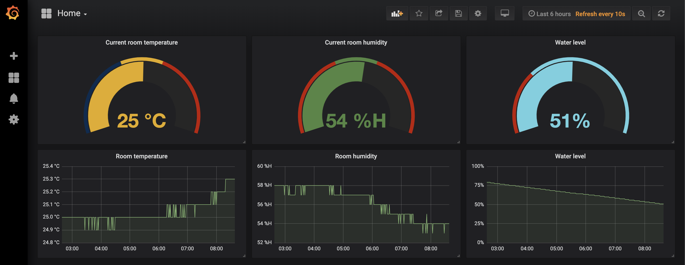

# Prometheus exporter for Xiaomi Smartmi Air Humidifier 2

Tested only with version zhimi.humidifier.ca1 / AirHumidifierCA1



## Get device token

Use instructions: [https://github.com/jghaanstra/com.xiaomi-miio/blob/master/docs/obtain_token.md](https://github.com/jghaanstra/com.xiaomi-miio/blob/master/docs/obtain_token.md)

Or just install patched app: [http://www.kapiba.ru/2017/11/mi-home.html](http://www.kapiba.ru/2017/11/mi-home.html)

## Run with Docker

```bash
docker run -d --name prometheus_humidifier -p 8000:8000 -e "TOKEN=xxxxxxxx" -e "IP=xx.xx.xx.xx" byumov/prometheus_humidifier
```

## Docker Hub

  

[https://hub.docker.com/r/byumov/prometheus_humidifier](https://hub.docker.com/r/byumov/prometheus_humidifier)
